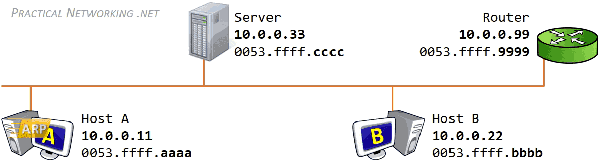

# Hacking Wifi

Mục Lục:

1. [Hack WIFI](#hack-wifi) 
    
    1.1. [Quá trình kết nối của wifi là gì?](#1-quá-trình-kết-nối-của-wifi-là-gì)
    
    1.2. [Làm sao để hack wifi?](#2-làm-sao-để-hack-wifi)
2. [Tool Hack Wifi](#tool-hack-wifi) 
3. [Với câu hỏi nếu không có USB Wifi và cả Kali Linux thì có hack wifi được không?](#với-câu-hỏi-nếu-không-có-usb-wifi-và-cả-kali-linux-thì-có-hack-wifi-được-không)
4. [Hacker là gì?](#hacker-là-gì)
5. [Man_In_The_Middle](#man-in-the-middle)
    
    5.1. [Chính xác thì tấn công Man-in-the-middle là gì?](#1-chính-xác-thì-tấn-công-man-in-the-middle-là-gì)
    
    5.2. [Làm thế nào nó hoạt động?](#2-làm-thế-nào-nó-hoạt-động)
    
6. [Change Mac](#change-mac) 
    
    6.1.[Tại sao mình có thể thay đổi giá trị mac đã lưu trên máy của người khác?](#tại-sao-mình-có-thể-thay-đổi-giá-trị-mac-đã-lưu-trên-máy-của-người-khác)
    
    6.2. [Vậy khi ra ngoài Internet và cụ thể là vào youtube thì bạn nghĩ chúng chỉ đi từ A → B?](#vậy-khi-ra-ngoài-internet-và-cụ-thể-là-vào-youtube-thì-bạn-nghĩ-chúng-chỉ-đi-từ-a--b)
    
    6.3. [Ta có thể giả mạo HOPS không?](#ta-có-thể-giả-mạo-hops-không)
    
7. [Tool MITM](#tool-mitm)
    
    7.1 [ARP Spoofing](#1-arp-spoofing)
    
    7.1.1 [ARP là gì?](#arp-là-gì)
    
    7.1.2 [Cách hoạt động của ARP?](#cách-hoạt-động-của-arp)
    
    7.1.3 [Vậy làm sao để có thể Hack ARP?](#vậy-làm-sao-để-có-thể-hack-arp)
    
    7.2 [ARP Poisoning](#arp-poisoning)
    
8. [HOW-ARP-WORKS](#how-arp-works)
9. [DONE-ARP-ATTACK](#done-arp-attack)
    
    9.1. [Hijack](#hijack)
    
    9.2 [Deny Of Service](#deny-of-service)
    
    9.3 [Man-In-The-Middle Attack](#man-in-the-middle-attack)
    
    9.4 [DEMO](#demo)
    
10. [DNS-SPOOFING](#dns-spoofing)
    
    10.1 [DNS là gì?](#dns-là-gì)
    
    10.2 [Cách hoạt động của DNS](#cách-hoạt-động-của-dns)
    
    10.3 [Làm sao để Hack DNS?](#1-làm-sao-để-hack-dns)
    
    10.4 [Làm sao Hacker có thể tận dụng các Flags này?](#làm-sao-hacker-có-thể-tận-dụng-các-flags-này)
    

---

---


# Hack-Wifi 


## 1. Trước khi hack wifi ta cần hiểu wifi là gì?

—Wi-Fi là một công nghệ mạng không dây được sử dụng rộng rãi để kết nối các thiết bị điện tử và truy cập vào Internet. Wi-Fi cho phép truyền dữ liệu qua sóng radio trong phạm vi không dây, giúp các thiết bị như máy tính, điện thoại di động, máy tính bảng, smart TV và các thiết bị thông minh khác có thể kết nối vào mạng và giao tiếp với nhau.

### 1. Quá trình kết nối của wifi là gì?

- Bắt tay 3 bước: khi một thiết bị muốn kết nối vào một mạng Wifi, nó thực hiện quá trình bắt tay 3 bước với điểm truy cập (access point). Quá trình bao gồm việc thiết lập kết nối và trao đổi thông tin bảo mật để xác thực thiết bị và mã hóa dữ liệu.
- 1.3.2 Kết nối duy trì: sau khi quá trình bắt tay 3 bước thành công, thiết bị và điểm truy cập thiết lập một kết nối duy trì. Kết nối này cho phép thiết bị gửi và nhận dữ liệu qua mạng Wifi.
### 2. Làm sao để hack wifi?

    Trước hết ta nên hiểu tạo sao 1 cục access point khi bật lên ta lại thấy chúng trong điện thoại của chúng ta? Tại sao ta di chuyển ra xa hay gần thì chúng luôn hiển thị độ mạnh yếu?

—Để hiểu hơn về vấn đề này, tôi sẽ giải thích:


—Các gói beacon (còn được gọi là gói tin phát sóng) là một loại gói tin được sử dụng trong các mạng không dây như Wi-Fi để truyền thông tin quan trọng về mạng và các điểm truy cập. Chức năng chính của các gói beacon là thông báo sự tồn tại và các thông tin cần thiết về một mạng không dây đến các thiết bị khác trong phạm vi tương tác.

- Và đây là cách hoạt động của các gói becon:
    1. Một điểm truy cập (Access Point - AP) hoặc một thiết bị khác trong mạng Wi-Fi phát các gói beacon định kỳ.
    2. Các gói `beacon` chứa các thông tin như tên mạng (SSID), mã kiểm tra xác thực (BSSID), cấu hình bảo mật, các dịch vụ hỗ trợ và thông tin khác về mạng.
    3. Các thiết bị khác như laptop, điện thoại thông minh trong phạm vi nhận các gói beacon.
    4. Các thiết bị này sử dụng thông tin từ gói beacon để xác định có sẵn mạng Wi-Fi nào và các thông số kỹ thuật liên quan.
    5. Các thiết bị có thể hiển thị danh sách các mạng Wi-Fi khả dụng cho người dùng, cung cấp thông tin như tín hiệu mạnh yếu, cấu hình bảo mật và tốc độ kết nối ước tính.
    6. Khi người dùng chọn một mạng Wi-Fi để kết nối, thiết bị gửi yêu cầu kết nối đến điểm truy cập thông qua quá trình xác thực và liên lạc dữ liệu.

    Tóm lại, các gói beacon có vai trò quan trọng trong mạng Wi-Fi để quảng bá mạng, cung cấp thông tin về mạng, cập nhật thông tin, đo lường tín hiệu và hỗ trợ tính năng định vị.

### 3. Câu hỏi đặt ra làm sao ta có thể bắt được gói becon?
- Có rất nhiều cách để bắt được các gói becon, bạn có thể sử dụng các công cụ và phần mềm chuyên dụng để giám sát và phân tích mạng Wi-Fi. Tôi sẽ cho bạn thấy một số ví dụ:
1. Sử dụng phần mềm chuyên dụng: Có nhiều phần mềm giám sát mạng Wi-Fi như Wireshark, tcpdump, Kismet, NetStumbler, hoặc các công cụ tương tự khác. Chúng cho phép bạn bắt và phân tích các gói tin trên mạng Wi-Fi, bao gồm cả gói beacon.
2. Sử dụng công cụ phân tích mạng: Một số thiết bị định tuyến, điểm truy cập hoặc bộ phát Wi-Fi cung cấp tính năng giám sát và phân tích mạng. Bằng cách truy cập giao diện quản trị của thiết bị, bạn có thể xem thông tin về các gói beacon, bao gồm tần số phát sóng, công suất tín hiệu, BSSID và các thông số kỹ thuật khác.
3. Sử dụng ứng dụng di động: Trên điện thoại di động, có một số ứng dụng di động như WiFi Analyzer (trên Android) hoặc AirPort Utility (trên iOS) cho phép bạn quét và xem thông tin về các mạng Wi-Fi xung quanh. Một số ứng dụng cung cấp tính năng hiển thị các gói beacon cụ thể để bạn có thể xem thông tin chi tiết về mạng.
- Nhưng với mục đích ban đầu là hack wifi chúng ta sẽ sử dụng 1 cục apdapter và dùng hệ điều hành Linux với Tcác tool trên đó như:
    1. `Aircrack-ng`: Một bộ công cụ mạnh mẽ cho việc bắt gói tin, tấn công WEP và WPA/WPA2, và phục hồi mật khẩu mạng Wi-Fi.
    2. `Reaver`: Một công cụ dùng để thực hiện tấn công WPS (Wi-Fi Protected Setup) và tìm ra mã PIN của một mạng Wi-Fi.
    3. `PixieWPS`: Một công cụ tấn công WPS khác, nhằm tìm ra mã PIN của một mạng Wi-Fi thông qua các phương pháp brute-force.
    4. `Bully`: Một công cụ khác để tấn công WPS, tương tự như Reaver, nhằm tìm ra mã PIN của một mạng Wi-Fi.
    5. `Wash`: Một công cụ quét mạng Wi-Fi để xác định xem mạng nào có WPS được kích hoạt.
    6. `hcxdumptool` và `hcxtools`: Các công cụ sử dụng để bắt gói tin và phục hồi mật khẩu từ tệp bắt gói.
    7. `Deauthcation attack`: là một cuộc tấn công trong lĩnh vực mạng Wi-Fi, mục tiêu của nó là ngắt kết nối giữa một thiết bị và mạng Wi-Fi mà thiết bị đó đang kết nối.

---

---

# TOOL-HACK-WIFI


## Aircrack-ng 
### 1. Bắt gói tin: 
Sử dụng công cụ `airodump-ng` để bắt gói tin trên một giao diện mạng không dây. Chạy lệnh sau để bắt gói tin trên một giao diện cụ thể:
        
```html
airodump-ng <interfac>
```
        
Trong đó, **`<interface>`** là tên giao diện mạng không dây của bạn (ví dụ: wlan0).
        
### 2. Chọn mạng mục tiêu: 
Tìm và chọn mạng Wi-Fi mục tiêu từ danh sách các mạng hiển thị trong kết quả của `airodump-ng`. Ghi nhớ kênh và địa chỉ BSSID của mạng mục tiêu.
### 3. Bắt gói tin cho mạng mục tiêu:
Chạy lệnh airodump-ng để bắt gói tin chỉ cho mạng Wi-Fi mục tiêu:
        
```html
aiodump-ng -c <channel> --bssid <BSSID> -w <output file> <interface>
```
        
Thay **`<channel>`** bằng số kênh của mạng mục tiêu và **`<BSSID>`** bằng địa chỉ BSSID của mạng mục tiêu. **`<output file>`** là tên tệp tin để lưu gói tin được bắt.
        
### 4. Tấn công bẻ khóa mật khẩu: 
Khi đã thu thập đủ gói tin, bạn có thể sử dụng công cụ aircrack-ng để thực hiện tấn công bẻ khóa mật khẩu. Chạy lệnh sau:
        
```html
aircrack-ng -w <wordlist> -b <BSSID> <capture file>
```
        
Thay **`<wordlist>`** bằng tệp tin từ điển chứa danh sách các mật khẩu tiềm năng. **`<BSSID>`** là địa chỉ BSSID của mạng mục tiêu và **`<capture file>`** là tệp tin ghi lại các gói tin được bắt ở bước trước.
        
Aircrack-ng sẽ thử từng mật khẩu trong danh sách từ điển cho đến khi tìm ra mật khẩu đúng.
        
### Cách hoạt động cơ bản của Airodump-ng:
1. Quét các mạng Wi-Fi: Khi chạy Airodump-ng trên một giao diện mạng không dây, nó sẽ quét và theo dõi các mạng Wi-Fi có sẵn trong phạm vi. Nó sẽ thu thập thông tin về mạng như địa chỉ MAC (BSSID), tên mạng (ESSID), kênh, mức công suất tín hiệu (Power), số lượng gói tin bắt được (Packets), và các thông tin khác.
2. Hiển thị thông tin: Airodump-ng hiển thị thông tin mạng Wi-Fi trong một bảng dữ liệu trên giao diện dòng lệnh. Thông tin về các mạng Wi-Fi sẽ được cập nhật liên tục để người dùng có thể theo dõi sự thay đổi và tương tác với các mạng này.
3. Bắt gói tin: Airodump-ng cũng có khả năng bắt và ghi lại các gói tin truyền qua mạng Wi-Fi. Khi được chỉ định một kênh và một địa chỉ BSSID của mạng mục tiêu, nó sẽ bắt và ghi lại các gói tin từ mạng này vào một tệp tin.
## Reaver 
### 1. Xác định mục tiêu: 
Đầu tiên, xác định mạng Wi-Fi mục tiêu mà bạn muốn tấn công và xác định xem nó hỗ trợ WPS hay không.
### 2. Chạy Reaver: 
Mở một cửa sổ terminal và chạy lệnh sau để bắt đầu tấn công với Reaver:
        
```html
reaver -i <interface> -b <BSSID> -c <channel>
```
        
Trong đó, **`<interface>`** là tên giao diện mạng không dây của bạn (ví dụ: wlan0), **`<BSSID>`** là địa chỉ BSSID của mạng mục tiêu, và **`<channel>`** là kênh của mạng mục tiêu.
        
### 3. Chờ đợi quá trình tấn công: 
Reaver sẽ thực hiện các yêu cầu WPS liên tục để tìm mật khẩu của mạng Wi-Fi. Quá trình này có thể mất một thời gian tùy thuộc vào độ phức tạp của mật khẩu và tính chất của mạng.
### 4. Ghi nhớ mật khẩu: 
Khi Reaver tìm thấy mật khẩu thành công, nó sẽ hiển thị mật khẩu trong kết quả trên terminal. Ghi nhớ mật khẩu này để bạn có thể sử dụng để kết nối vào mạng Wi-Fi mục tiêu.
### Cách hoạt động của Reaver:
#### 1. Bắt đầu tấn công: 
Reaver thực hiện việc tấn công đường dẫn WPS trên mạng Wi-Fi mục tiêu để tìm ra mật khẩu. Quá trình này bao gồm các bước sau:
        
B1. **Gửi yêu cầu WPS**: Reaver gửi các yêu cầu WPS đến điểm truy cập Wi-Fi mục tiêu để yêu cầu thông tin về mạng và truy cập vào chế độ cấu hình WPS.
        
B2. **Tìm kiếm PIN**: Reaver thực hiện việc tìm kiếm PIN (Personal Identification Number) của mạng Wi-Fi mục tiêu. PIN là một số có 8 chữ số được sử dụng trong quá trình thiết lập WPS.
        
B3. **Kiểm tra sự phản hồi**: Reaver kiểm tra sự phản hồi từ điểm truy cập Wi-Fi sau mỗi lần thử PIN. Nếu PIN đúng, Reaver sẽ nhận được phản hồi thành công từ điểm truy cập.
        
B4. **Thử PIN tiếp theo**: Reaver sẽ tiếp tục thử các PIN khác để tìm ra PIN đúng. Quá trình này tiếp tục cho đến khi Reaver tìm ra PIN chính xác và xác định mật khẩu của mạng Wi-Fi.
        
#### 2. Hiển thị kết quả: 
Khi Reaver tìm ra PIN đúng và bẻ khóa thành công mật khẩu mạng Wi-Fi, nó sẽ hiển thị mật khẩu trên giao diện người dùng. Bạn có thể sử dụng mật khẩu này để kết nối vào mạng Wi-Fi mục tiêu.
    
---
    
---
    
### Thực hành
    

    
## PixieWPS 
### 1. Xác định mục tiêu: 
Trước khi bắt đầu sử dụng PixieWPS, bạn cần xác định mạng Wi-Fi mục tiêu mà bạn muốn tấn công và xác định xem nó hỗ trợ WPS và có dấu hiệu về lỗ hổng Pixie-Dust hay không.
### 2. Chạy PixieWPS: 
Mở một cửa sổ terminal và chạy lệnh sau để bắt đầu tấn công với PixieWPS:
        
```html
pixiewps -e <ESSID> -r <PKE> -s <PKR> -z
```
        
- Trong đó:
    - **`<ESSID>`** đại diện cho tên mạng (ESSID) của mạng Wi-Fi mục tiêu. Bạn cần cung cấp tên mạng này để PixieWPS biết mục tiêu của cuộc tấn công.
    - **`<PKE>`** là tệp chứa dữ liệu PKE (Public Key Encryption). Dữ liệu này cần được thu thập từ giao tiếp giữa điểm truy cập và thiết bị khách trong quá trình trao đổi thông tin về WPS. Bạn cần cung cấp tệp này cho PixieWPS để nó có thể sử dụng trong quá trình tính toán PIN.
    - **`<PKR>`** là tệp chứa dữ liệu PKR (Public Key Reconstruction). Dữ liệu này cũng được thu thập từ giao tiếp giữa điểm truy cập và thiết bị khách và được sử dụng để tái tạo khóa công khai cho quá trình tính toán PIN. Bạn cần cung cấp tệp này cho PixieWPS để nó có thể sử dụng trong quá trình tính toán PIN.
    - **`z`** là một tùy chọn trong PixieWPS để thực hiện tấn công Pixie-Dust. Pixie-Dust là một phương pháp tấn công được sử dụng để bẻ khóa mật khẩu WPS bằng cách tính toán giá trị PIN thông qua các khóa công khai thu thập được từ giao tiếp WPS.
### Cách hoạt động:
#### 1. Thu thập dữ liệu: 
Đầu tiên, bạn cần thu thập dữ liệu PKE (Public Key Encryption) và PKR (Public Key Reconstruction) từ giao tiếp giữa điểm truy cập (AP) và thiết bị khách. Các gói tin chứa dữ liệu này được gửi trong quá trình giao tiếp WPS.
#### 2. Phân tích dữ liệu: 
PixieWPS sẽ sử dụng các dữ liệu PKE và PKR thu thập được để phân tích và tái tạo khóa công khai liên quan đến quá trình tính toán PIN.
#### 3. Tìm kiếm giá trị PIN: 
Sau khi phân tích dữ liệu, PixieWPS sẽ bắt đầu tìm kiếm giá trị PIN thông qua tấn công Pixie-Dust. Tấn công Pixie-Dust sẽ thử các giá trị PIN khác nhau để xác định giá trị PIN chính xác.
#### 4. Bẻ khóa mật khẩu: 
Khi PixieWPS tìm thấy giá trị PIN chính xác, nó sẽ sử dụng giá trị PIN đó để bẻ khóa mật khẩu mạng Wi-Fi. Mật khẩu bẻ khóa sẽ được hiển thị trên màn hình hoặc lưu vào một tệp tin để bạn sử dụng để kết nối vào mạng Wi-Fi mục tiêu.
        
## Bully
### 1. Kiểm tra tương thích: 
Trước tiên, bạn nên kiểm tra xem thiết bị mạng của bạn có hỗ trợ Bully hay không. Bạn có thể kiểm tra bằng cách chạy lệnh "`bully --help`" để xem các tùy chọn và kiểm tra xem Bully đã được cài đặt và sẵn sàng hoạt động.
### 2. Chạy Bully: 
Để chạy Bully, bạn cần cung cấp thông tin về giao diện mạng, ESSID (tên mạng Wi-Fi) và BSSID (địa chỉ MAC của điểm truy cập). Ví dụ, lệnh dưới đây sẽ chạy Bully để tấn công mạng Wi-Fi với tên "MyNetwork" và địa chỉ MAC là "`00:11:22:33:44:55`":
        
```html
bully -b 00:11:22:33:44:55 -e MyNetwork wlan0
```
        
### 3. Chờ kết quả: 
Bully sẽ thực hiện tấn công bẻ khóa PIN WPS trên mạng Wi-Fi mục tiêu. Quá trình này có thể mất một khoảng thời gian tùy thuộc vào sự phức tạp của mật khẩu và khả năng bảo vệ WPS của điểm truy cập. Bully sẽ hiển thị thông báo về kết quả tấn công và mật khẩu nếu thành công.
### Cách hoạt động của Bully:
#### 1. Thu thập thông tin: 
Đầu tiên, Bully sẽ thu thập thông tin cần thiết về mạng Wi-Fi mục tiêu. Điều này bao gồm ESSID (tên mạng Wi-Fi) và BSSID (địa chỉ MAC của điểm truy cập).
#### 2. Tìm kiếm PIN hợp lệ: 
Bully sử dụng phương pháp thử và lỗi để tìm kiếm các giá trị PIN hợp lệ trên mạng Wi-Fi mục tiêu. Nó sẽ thử từng giá trị PIN theo một thứ tự nhất định để xác định PIN chính xác.
#### 3. Thực hiện tấn công: 
Bully sẽ gửi các yêu cầu kết nối WPS đến điểm truy cập với các giá trị PIN khác nhau. Nó sẽ tiếp tục thử các giá trị PIN cho đến khi tìm thấy một giá trị PIN hợp lệ hoặc quá trình tìm kiếm bị dừng lại.
#### 4. Kết quả tấn công: 
Nếu Bully tìm thấy một giá trị PIN hợp lệ, nó sẽ hiển thị kết quả và mật khẩu mạng Wi-Fi được bẻ khóa thành công. Nếu quá trình tấn công không thành công, Bully sẽ thông báo cho bạn biết.
        
---
        
---
        
### Thực Hành
        

        

        
## Wash 
### 1. Chạy Wash: 
Để chạy Wash, bạn cần mở terminal và chạy lệnh sau:
        
```html
wash -i <interface>
```
        
Trong đó, **`<interface>`** là tên giao diện mạng mà bạn muốn sử dụng để tìm kiếm các điểm truy cập Wi-Fi. Ví dụ: **`wlan0`**, **`wlan1`**,...
        
### 2. Chờ kết quả: 
Wash sẽ bắt đầu quét các kênh Wi-Fi và tìm kiếm các điểm truy cập có tính năng WPS. Nó sẽ hiển thị các thông tin như BSSID (địa chỉ MAC của điểm truy cập), ESSID (tên mạng Wi-Fi), và trạng thái WPS (bật/tắt).
### 3. Phân tích kết quả: 
Khi quét hoàn tất, bạn có thể xem các kết quả trên terminal. Thông tin này cung cấp cái nhìn tổng quan về các điểm truy cập Wi-Fi có tính năng WPS trên mạng.
### Cách hoạt động của Wash:
#### 1. Quét các kênh Wi-Fi: 
Wash sẽ quét qua các kênh Wi-Fi trên một giao diện mạng cụ thể (ví dụ: wlan0). Các kênh này chứa tín hiệu Wi-Fi được phát ra từ các điểm truy cập gần đó.
#### 2. Phát hiện tín hiệu WPS: 
Wash sẽ kiểm tra tín hiệu Wi-Fi trên các kênh và tìm kiếm các tín hiệu có tính hiệu WPS. Tín hiệu WPS thường có một tín hiệu đặc biệt trong gói tin truyền đi, giúp Wash nhận biết rằng điểm truy cập đó hỗ trợ WPS.
#### 3. Xác định thông tin mạng: 
Khi Wash phát hiện tín hiệu WPS, nó sẽ trích xuất thông tin về mạng Wi-Fi tương ứng, bao gồm địa chỉ MAC (BSSID), tên mạng (ESSID) và trạng thái WPS (bật/tắt).
#### 4. Hiển thị kết quả: 
Wash sẽ hiển thị các thông tin mạng Wi-Fi có tính hiệu WPS mà nó đã xác định được. Điều này giúp người dùng nhận ra các mạng Wi-Fi có khả năng bị tấn công WPS hoặc kiểm tra tính bảo mật của mạng Wi-Fi của họ.
            
---
            
---
            
### Thực Hành:
            

            
## Hcxdumptool và Hcxtools 
    
Hcxdumptool và Hcxtools là hai công cụ được sử dụng trong Kali Linux để thu thập và xử lý thông tin liên quan đến các giao thức bảo mật Wi-Fi WPA/WPA2.
    
> Sử dụng hcxdumptool để thu thập thông tin:
> 
#### Bước 1: Mở terminal và chạy lệnh sau để kiểm tra các giao diện mạng có sẵn:
        
```css
hcxdumptool -iwlan0 --check
```
        
#### Bước 2: Chạy lệnh sau để thu thập thông tin gói tin handshake từ một mạng Wi-Fi cụ thể:
        
```css
hcxdumptool -i wlan0 -o capture.pcapng --enable_status=1 --filterlist=filter.txt
```
        
##### Trong đó:
        
- **`i wlan0`** là tên giao diện mạng bạn muốn sử dụng.
- **`o capture.pcapng`** là tên tệp PCAP để lưu trữ gói tin thu thập được.
- **`-enable_status=1`** để hiển thị trạng thái thu thập gói tin trên terminal.
- **`-filterlist=filter.txt`** là tệp chứa danh sách các BSSID (địa chỉ MAC của điểm truy cập) mà bạn muốn thu thập.
#### Bước 3: Để thu thập thông tin PMKID (Pre-Shared Master Key Identifier), chạy lệnh sau:
```css
hcxdumptool -i wlan0 -o capture.pcapng --enable_status=1 --filterlist=filter.txt --pmkid
```
        
### PKMID là gì?
PMKID (Pre-Shared Master Key Identifier) là một giá trị nhận dạng được sử dụng trong giao thức bảo mật Wi-Fi WPA/WPA2. PMKID là một phần của quá trình xác thực khóa chia sẻ trước (pre-shared key) giữa thiết bị client và điểm truy cập (AP).
            
Khi một thiết bị client muốn kết nối với một mạng Wi-Fi sử dụng WPA/WPA2, quá trình xác thực sẽ diễn ra. Trong quá trình này, PMKID được tạo ra từ pre-shared key (PSK), địa chỉ MAC của client (PMKID được liên kết với client) và địa chỉ MAC của điểm truy cập (AP).
            
    
> Sử dụng hcxtools để xử lý thông tin thu thập:
> 
#### Bước 1: Mở terminal và chạy lệnh sau để chuyển đổi tệp PCAP thành định dạng hccapx:
    
```
hcxpcapngtool -z capture.pcapng -j output.16800
```
    
#### Bước 2: Để xem thông tin trong tệp hccapx, chạy lệnh sau:
    
```
hcxinfo output.16800
```
    
#### Bước 3: Để tìm kiếm mật khẩu bằng cách sử dụng tệp hccapx và từ điển, chạy lệnh sau:
```
hashcat -m 16800 -a 0 output.16800 dictionary.txt
```
    
#### Trong đó:
    
- **`m 16800`** là tham số sử dụng để chỉ định loại hàm băm WPA/WPA2 trong quá trình tấn công. Trong trường hợp này, giá trị 16800 tương ứng với hàm băm WPA/WPA2 (PMKID).
- **`a 0`** là tham số sử dụng để chỉ định phương pháp tấn công. Giá trị 0 đại diện cho tấn công từ điển (dictionary attack), trong đó hashcat sẽ thử các mật khẩu từ một tệp từ điển cho đến khi tìm thấy mật khẩu khớp.
- **`output.16800`** là tên tệp hccapx cần tấn công. Đây là tệp chứa thông tin về PMKID (bao gồm cả SSID, BSSID, PMKID, và nonce) được thu thập từ quá trình bẻ khóa mạng Wi-Fi.
- **`dictionary.txt`** là tệp từ điển chứa các mật khẩu tiềm năng mà hashcat sẽ thử đối chiếu với PMKID để tìm ra mật khẩu đúng.
## Deauthcation attack 
Deauthentication là một gói tin được sử dụng trong mạng Wifi để ngắt kết nối giữa một thiết bị và điểm truy cập(access point). Gói tin deauth không yêu cầu xác thực và không được mã hóa, Nó được sử dụng để đẩy thiết bị khỏi mạng Wifi hoặc buộc nó phải thiết lập lại kết nối.
    
### Cách để deauth các thiết bị:
#### 1. Xác định mạng Wi-Fi mục tiêu: 
Sử dụng các công cụ như Airodump-ng hoặc Wash để xác định mạng Wi-Fi mục tiêu. Ghi nhớ địa chỉ MAC của mạng Wi-Fi đó.
#### 2. Chuyển card mạng vào chế độ monitor mode: 
Sử dụng lệnh sau để chuyển card mạng vào chế độ monitor mode:
```html
sudo airmon-ng start <interface>
```
        
Thay thế **`<interface>`** bằng tên của card mạng Wi-Fi mà bạn muốn sử dụng.
        
#### 3. Bắt đầu gửi gói tin Deauth: 
Sử dụng lệnh sau để bắt đầu gửi gói tin Deauth đến mạng Wi-Fi mục tiêu:
```
sudo aireplay-ng --deauth <number of deauth packets> -a <BSSID> -c <client MAC> <interface>
```
        
- Thay thế **`<number of deauth packets>`** bằng số lượng gói tin Deauth bạn muốn gửi. Giá trị 0 có thể được sử dụng để gửi gói tin Deauth vô hạn.
- Thay thế **`<BSSID>`** bằng địa chỉ MAC của mạng Wi-Fi mục tiêu.
- Thay thế **`<client MAC>`** bằng địa chỉ MAC của thiết bị mà bạn muốn ngắt kết nối khỏi mạng Wi-Fi.
- Thay thế **`<interface>`** bằng tên của card mạng Wi-Fi đã ở chế độ monitor mode.
### Cách hoạt động:
- Khi thiết bị nhận được gói tin Deauth, nó có thể tưởng tượng rằng nó là trạm cơ sở (Access Point) đang yêu cầu các thiết bị kết nối đến mình ngắt kết nối. Điều này là do gói tin Deauth được gửi với địa chỉ nguồn (source MAC address) và địa chỉ đích (destination MAC address) được giả mạo để tạo ra sự ảnh hưởng giống như gói tin Deauth được gửi từ một trạm cơ sở thực tế.
- Khi thiết bị nhận được gói tin Deauth và coi nó như một tín hiệu từ trạm cơ sở, nó sẽ phản hồi bằng cách ngắt kết nối với trạm cơ sở. Kết quả là, thiết bị sẽ mất kết nối với mạng Wi-Fi và do đó mất kết nối Internet.

---

---

## Với câu hỏi nếu không có USB Wifi và cả Kali Linux thì có hack wifi được không?
> 

>Câu trả lời là được.

Vì mục đích của việc hack wifi là thu thập thông tin, trên các hệ điều hành đều sẽ có những tool khác nhau có thể dùng card vật lý của máy chúng ta để scan các mạng xung quanh, từ đó ta sẽ phân tích các gói đã scan bằng các công cụ có sẵn trên Internet

### Ví dụ bên dưới:

#### Wordlist:

```jsx
https://github.com/linuxsyr/10m-Wordlist-
```

________

#### aircrack for windows:

```jsx
https://www.aircrack-ng.org/
```

__________

####  CommView for WiFi:

https://www.tamos.com/download/main/

https://www.tamos.com/files/ca7.zip

---

---

> Bên trên là các cách để chúng ta có thể bắt được hoặc phá rối các thiết bị, nhưng đó chưa thật sự gọi là Hacker.
## Hacker là gì?

Hacker là một người thật sự tỉnh táo và là một người có khả năng phân tích đường đi rất tuyệt vời. Khác với các script kiddie, hacker đều có kiến thức chuyên sâu về hệ thống máy tính, mạng và bảo mật thông tin. Họ tìm hiểu sâu về các công nghệ và cách thức hoạt động của chúng, từ đó phân tích và tìm ra các lỗ hổng bảo mật tiềm ẩn.

Khi một hacker đã xâm nhập vào một dịch vụ trái phép, hacker không như script kiddie. Thay vì phá hoại mọi thứ, hacker thực sự chỉ muốn xem các thông tin trong dịch vụ đó. Hacker có khả năng tiếp cận các hệ thống, cơ sở dữ liệu hoặc các tài khoản người dùng để thu thập thông tin quan trọng hoặc nhạy cảm.

Mục đích chính của hacker trong trường hợp này thường liên quan đến việc tìm hiểu và thu thập thông tin để khai thác hoặc sử dụng cho mục đích cá nhân. Họ có thể tìm kiếm các thông tin như dữ liệu cá nhân, thông tin tài khoản, thông tin tài chính hoặc bí mật công nghệ.

---

---


## Man-In-The-Middle


> Trong số các thủ thuật để lấy được nội dung về các thông tin nhạy cảm của người dùng, tôi đề nghị cho bạn một thủ thuật được gọi là Man-In-The-Middle (MITM) attack
> 
### 1. Chính xác thì tấn công Man-in-the-middle là gì?
Khi dữ liệu rời khỏi điểm cuối này đến điểm cuối khác, khoảng thời gian truyền dẫn là lúc quyền kiểm soát đối với nó bị mất đi phần nào. Khi kẻ tấn công tự đặt mình vào giữa các điểm cuối và chặn và/hoặc giả mạo dữ liệu đang truyền này, nó được gọi là tấn công trung gian (MiTM)

#### Chính xác thì một cuộc tấn công trung gian là gì?
Trong quá trình truyền dữ liệu giữa một thiết bị và máy chủ, attacker sẽ dùng kỹ năng và tool của mình để đặt mình vào giữa 2 thiết bị đầu cuối. Trong khi 2 bên tin rằng chúng đang trò chuyện mà không ai biết.
#### 2. Làm thế nào nó hoạt động?
Khi nói đến các cuộc tấn công MITM, không chỉ có một phương pháp duy nhất có thể gây ra thiệt hại
    
>Có bốn phương pháp! Nói chung, có Sniffing, Packet Injection, Session Hijacking và SSL Stripping.
    
#### Sniffing: 
Sniffing hoặc Packet Sniffing là một kỹ thuật được sử dụng để nắm bắt các gói dữ liệu chảy vào và ra khỏi hệ thống/mạng. Packet Sniffing trong mạng tương đương với nghe lén trong điện thoại.
#### Packet Injection: 
Trong kỹ thuật này, kẻ tấn công tiêm các gói dữ liệu độc hại cùng với dữ liệu thông thường. Bằng cách này, người dùng thậm chí không nhận thấy các tệp/phần mềm độc hại vì chúng là một phần của luồng liên lạc hợp pháp. Các tệp này là một mặt hàng phổ biến trong các cuộc tấn công trung gian cũng như các cuộc tấn công từ chối dịch vụ.
#### Session Hijacking: 
Các phiên này thường là mục tiêu của tin tặc vì chúng có khả năng chứa thông tin kín đáo. Trong hầu hết các trường hợp, tin tặc thiết lập sự hiện diện của mình trong phiên và cuối cùng chiếm quyền kiểm soát phiên đó. Những cuộc tấn công này có thể được thực hiện theo nhiều cách khác nhau.
#### SSL Stripping: 
Các cuộc tấn công SSL Stripping hoặc Downgrade attacks là một loại tấn công hiếm gặp khi nói đến các cuộc tấn công MiTM, nhưng cũng là loại nguy hiểm nhất. Như chúng ta đã biết, chứng chỉ SSL/TLS giữ cho thông tin liên lạc trực tuyến của chúng ta được an toàn thông qua mã hóa. Trong các cuộc tấn công SSL Stripping, kẻ tấn công ngắt kết nối SSL/TLS và giao thức được chuyển từ HTTPS an toàn sang HTTP không an toàn.
    
---
    
---
    

## CHANGE-MAC
### Tại sao mình có thể thay đổi giá trị mac đã lưu trên máy của người khác?
Khi một thiết bị gửi một gói tin ARP yêu cầu (ARP request) để tìm địa chỉ MAC tương ứng với địa chỉ IP, các thiết bị trong mạng nhận gói tin này và trả lời bằng một gói tin ARP đáp ứng (ARP reply) chứa thông tin ánh xạ. Tuy nhiên, vì giao thức ARP không cung cấp cơ chế xác thực, bất kỳ thiết bị nào trong mạng cũng có thể gửi một gói tin ARP đáp ứng giả mạo (spoofed ARP reply) và đưa ra thông tin ánh xạ sai.
    
### Vậy khi ra ngoài Internet và cụ thể là vào youtube thì bạn nghĩ chúng chỉ đi từ A → B?

Câu trả lời là KHÔNG. Vì sao ư?
        

        
Khi bạn truy cập vào một trang web như YouTube, thông tin của bạn sẽ đi qua nhiều hop trên mạng Internet để đến được máy chủ của YouTube. Số lượng hop và đường đi cụ thể có thể khác nhau tùy thuộc vào cấu trúc mạng, băng thông và tuyến đường mạng.
        
Trên mạng Internet, dữ liệu đi qua các nút định tuyến và thiết bị mạng để đến được đích cuối cùng. Mỗi hop trên đường đi có thể đại diện cho một máy chủ, router hoặc các thiết bị mạng khác. Số lượng hop có thể thay đổi tuỳ thuộc vào cấu trúc mạng và tuyến đường mà gói tin của bạn phải đi qua.
        
Để định vị và xác định đường dẫn tốt nhất từ nguồn đến đích, thông tin về địa chỉ IP, giao thức định tuyến và bảng định tuyến được sử dụng. Trình duyệt của bạn và các thiết bị mạng trên đường đi sẽ tự động tìm kiếm đường dẫn tốt nhất và nhanh nhất để truyền gửi dữ liệu.
        
Tuy nhiên, số lượng hop trên đường đi từ nguồn đến đích không phải lúc nào cũng là một con số cố định. Nó có thể thay đổi do nhiều yếu tố như địa điểm đích, địa điểm nguồn, độ tải mạng và các yếu tố kỹ thuật khác.
        
Vì vậy, khi truy cập vào YouTube hoặc các trang web khác trên Internet, thông thường bạn sẽ đi qua nhiều hop trên đường đi, và số lượng hop này có thể khác nhau trong các trường hợp khác nhau.
        
    
### Ta có thể giả mạo HOPS không?
> 
#### Tất nhiên là có thể!

#### Làm thế nào ư?
        
Những kẻ tấn công có thể thực hiện các kỹ thuật giả mạo hoặc tấn công trung gian (man-in-the-middle attacks) để làm giả một hop và đạt được tốc độ nhanh nhất và độ tin cậy cao. Các phương pháp tấn công như ARP spoofing, DNS cache poisoning hoặc BGP hijacking có thể được sử dụng để điều hướng lưu lượng mạng thông qua các hop được kiểm soát bởi kẻ tấn công.
        
Kẻ tấn công có thể sử dụng kỹ thuật giả mạo hop để thu thập thông tin nhạy cảm, theo dõi hoạt động truy cập của người dùng, thay đổi hoặc thêm dữ liệu vào gói tin, hoặc thậm chí chặn và chuyển hướng các yêu cầu của người dùng đến các trang web hoặc máy chủ giả mạo.
        
Để ngăn chặn các loại tấn công này, có nhiều biện pháp bảo mật mạng như sử dụng mã hóa, chứng thực hai yếu tố, sử dụng giao thức bảo mật và kiểm tra tính toàn vẹn của dữ liệu. Ngoài ra, việc duy trì các cập nhật bảo mật, giám sát mạng và sử dụng các công cụ phát hiện xâm nhập cũng rất quan trọng để ngăn chặn các cuộc tấn công này.
        
---
        
---
        

## TOOL-MITM
### Dưới đây là một số phương pháp thường được sử dụng để thực hiện MITM:
#### 1. ARP Spoofing: 
Sử dụng kỹ thuật ARP Spoofing để gian lận bảng ARP trong mạng và định tuyến gói tin qua thiết bị tấn công trung gian. Điều này cho phép tấn công trung gian theo dõi và thay đổi nội dung gửi và nhận giữa hai bên trong mạng.
#### 2. DNS Spoofing: 
Sử dụng kỹ thuật DNS Spoofing để đánh lừa máy chủ DNS và chuyển hướng lưu lượng mạng tới máy chủ DNS giả mạo. Từ đó, tấn công trung gian có thể kiểm soát và thay đổi các yêu cầu DNS và phản hồi để làm sai lệch thông tin mạng.
#### 3. IP Spoofing: 
Sử dụng kỹ thuật IP Spoofing để gian lận địa chỉ IP nguồn trong gói tin và giả mạo danh tính nguồn. Điều này có thể giúp tấn công trung gian đánh lừa các bên trong mạng và tạo ra một sự nhầm lẫn về nguồn gốc gói tin.
#### 4. SSL/TLS Stripping: 
Sử dụng kỹ thuật SSL/TLS Stripping để tấn công trung gian giữa hai bên trong một kết nối SSL/TLS bảo mật. Điều này cho phép tấn công trung gian theo dõi và thay đổi dữ liệu truyền qua kết nối SSL/TLS mà không bị phát hiện.
#### 5. Rogue Access Point: 
Thiết lập một Rogue Access Point giả mạo và thu thập lưu lượng mạng của các thiết bị kết nối đến điểm truy cập giả. Điều này cho phép tấn công trung gian theo dõi, chặn và thay đổi thông tin truyền qua mạng.
    
---
    
---
    
## ARP
    
### ARP là gì?
    
ARP (Address Resolution Protocol) là một giao thức trong mạng máy tính dùng để ánh xạ địa chỉ IP (Internet Protocol) sang địa chỉ MAC (Media Access Control). Giao thức ARP giúp xác định địa chỉ MAC của một thiết bị trong mạng dựa trên địa chỉ IP của nó.
    
### Cách hoạt động của ARP?
Khi một thiết bị muốn gửi dữ liệu đến một địa chỉ IP khác trong cùng mạng, nó sẽ kiểm tra bảng ARP của mình để xem liệu địa chỉ MAC của thiết bị đó đã được ánh xạ hay chưa. Nếu không có thông tin trong bảng ARP, thiết bị gửi yêu cầu ARP broadcast để hỏi tất cả các thiết bị trong mạng rằng "Ai là chủ sở hữu của địa chỉ IP này?".
    

    
Thiết bị có địa chỉ IP cần được ánh xạ sẽ nhận được yêu cầu ARP và gửi lại một tin nhắn chứa địa chỉ MAC của nó cho thiết bị gửi yêu cầu. Sau đó, thiết bị gửi yêu cầu ARP sẽ lưu địa chỉ MAC này vào bảng ARP của mình để sử dụng trong các truyền dữ liệu tiếp theo đến địa chỉ IP tương ứng.
    
Giao thức ARP chủ yếu hoạt động ở tầng mạng (tầng 3) và tầng liên kết dữ liệu (tầng 2) trong mô hình OSI. Nó là một phần quan trọng trong quá trình truyền dữ liệu và giúp thiết bị trong mạng tìm hiểu và giao tiếp với nhau thông qua việc ánh xạ địa chỉ IP và MAC.
    
### Vậy làm sao để có thể Hack ARP?
    

    
### **Operation** (**request or reply) là nơi mà chúng ta cần chú ý đến khi Hack ARP**
    
### Vì sao ư?
Một số lý do tại sao trường "Operation" của ARP có thể là điểm tấn công dễ dàng cho hacker là:
#### 1. Spoofing (giả mạo): 
Hacker có thể giả mạo gói tin ARP request hoặc reply để làm cho các thiết bị mạng tin rằng địa chỉ MAC của hacker là đích hoặc nguồn của gói tin. Điều này có thể dẫn đến các cuộc tấn công gián đoạn kết nối, tấn công nghe trộm hoặc tấn công xâm nhập.
#### 2. ARP cache poisoning (độc chiếm bộ nhớ cache ARP): 
Hacker có thể gửi gói tin ARP reply giả mạo cho các thiết bị trong mạng để lừa đảo và làm thay đổi bảng ARP của các thiết bị. Điều này có thể dẫn đến việc chuyển hướng lưu lượng mạng hoặc tấn công Man-in-the-Middle.
#### 3. ARP flooding (tràn ARP): 
Hacker có thể gửi một lượng lớn gói tin ARP request không hợp lệ hoặc gian lận, gây tắc nghẽn băng thông mạng hoặc gây quá tải cho các thiết bị mạng.
    
---
    
---
    

## ARP Spoofing
### ARP Spoofing là gì?
ARP poisoning (còn được gọi là ARP spoofing) là một cuộc tấn công mạng được thực hiện thông qua các tin nhắn ARP độc hại. Trong cuộc tấn công này, tin tặc giả mạo hoặc thay đổi thông tin trong các gói tin ARP để đánh lừa các thiết bị trong mạng và lấy được quyền kiểm soát hoặc truy cập vào thông tin mạng.

Một cuộc tấn công ARP rất khó phát hiện và một khi nó đã xảy ra, tác động là không thể bỏ qua. Điều này là do ARP poisoning là một cuộc tấn công ẩn danh và không tạo ra các sự cảnh báo rõ ràng, khiến cho việc phát hiện và ngăn chặn nó trở nên khó khăn.

Một tin tặc thực hiện thành công giả mạo ARP hoặc đầu độc ARP có thể giành quyền kiểm soát mọi tài liệu trên mạng của bạn. Bằng cách này, tin tặc có thể theo dõi hoạt động của bạn, truy cập vào thông tin nhạy cảm và thậm chí gây đình trệ lưu lượng truy cập của bạn. Tin tặc có thể sử dụng thông tin này để yêu cầu tiền chuộc hoặc thực hiện các hoạt động xấu khác.

---
---
    

## ARP Poisoning
### ARP Poisoning là gì?
ARP poisoning (đầu độc ARP) là một phương pháp tấn công mạng trong đó tin tặc thay đổi bảng ARP của một hệ thống mạng. Bảng ARP chứa các bản ghi kết hợp địa chỉ IP với địa chỉ MAC tương ứng của các thiết bị trong mạng. Khi bảng ARP bị đầu độc, các bản ghi này được thay thế bằng các địa chỉ MAC giả mạo.

Kết quả là, khi các thiết bị trong mạng gửi các yêu cầu gửi dữ liệu, chúng sẽ sử dụng địa chỉ MAC giả mạo mà tin tặc đã đưa vào bảng ARP. Điều này dẫn đến sự lây lan lan rộng của thông tin và lưu lượng mạng thông qua tin tặc. Tin tặc có thể sử dụng kỹ thuật đầu độc ARP để gián đoạn hoạt động mạng, thực hiện các cuộc tấn công (Man-in-the-Middle attack), theo dõi hoạt động mạng, hoặc thậm chí đánh cắp thông tin nhạy cảm.
        

        
    
---
    
---
    

## HOW-ARP-WORKS
### Trước khi muốn tấn công vào Access Point (AP) và Victim (User) thì ta nên biết ARP là gì?
Cơ sở của ARP (Address Resolution Protocol) là media access control (MAC). Như các chuyên gia đã giải thích, MAC là một địa chỉ duy nhất của network interface card ethernet (NIC) được cấp phần cứng. Địa chỉ MAC này được gán khi thiết bị được sản xuất và thường không thay đổi, tuy nhiên có thể được thay đổi bằng phần mềm.
    
### Theo lý thuyết, ARP hoạt động như sau:
#### **Accept requests**: 
Khi một thiết bị mới yêu cầu tham gia mạng cục bộ (LAN) và cung cấp địa chỉ IP của nó, ARP chấp nhận yêu cầu này.
#### 2. **Translate**: 
Vì các thiết bị trong mạng LAN giao tiếp với nhau thông qua địa chỉ MAC, ARP dịch địa chỉ IP thành địa chỉ MAC tương ứng.
#### 3. **Send requests**: 
Nếu ARP không biết địa chỉ MAC tương ứng cho một địa chỉ IP cụ thể, nó sẽ gửi một yêu cầu gói tin ARP. Gói tin này truy vấn các thiết bị khác trên mạng để tìm thông tin cần thiết.
    
    Đây là cách ARP hoạt động trong việc ánh xạ địa chỉ IP và địa chỉ MAC trong mạng LAN.
    
---
    
---
    

## DONE-ARP-ATTACK

    
### Khi kết thúc thành công ARP attack thì hacker có thể:
        
#### Hijack:
        
    

    
Khi một cuộc tấn công hijack xảy ra, kẻ tấn công thường sẽ giành quyền kiểm soát truyền thông và có thể thực hiện các hoạt động như đọc, thay đổi, hoặc thậm chí ngăn chặn dữ liệu mà không để hai bên gửi và nhận biết được. Điều này có thể dẫn đến việc đánh cắp thông tin nhạy cảm, lừa đảo, hoặc thực hiện các hành động độc hại trên hệ thống mạng.
 
Hijacking có thể được thực hiện thông qua nhiều phương pháp, bao gồm sử dụng kỹ thuật giả mạo ARP, giả mạo DNS, chiếm quyền kiểm soát tài khoản người dùng, hoặc tấn công trung man. Mục tiêu của hijack thường là chiếm quyền kiểm soát dữ liệu mạng và tận dụng nó cho mục đích cá nhân hoặc tấn công tiếp theo.
        
#### Deny Of Service:
        
Denial of Service (DoS) là một cuộc tấn công mạng nhằm làm cho một dịch vụ hoặc hệ thống mạng trở nên không khả dụng đối với người dùng hợp lệ. Trong trường hợp này, kẻ tấn công tạo ra một lưu lượng truy cập lớn hoặc khai thác các lỗ hổng trong hệ thống để quá tải tài nguyên của nó, gây ra sự chậm trễ hoặc sự cố hoàn toàn cho dịch vụ đích.

DoS có thể được thực hiện bằng nhiều cách, bao gồm gửi một số lượng lớn yêu cầu không hợp lệ đến một máy chủ, lợi dụng các lỗ hổng bảo mật để làm cho hệ thống bị treo hoặc bị đánh cắp tài nguyên, hoặc tấn công bằng cách flood mạng với lưu lượng truy cập cao.

Mục tiêu của cuộc tấn công DoS là làm cho dịch vụ hoặc hệ thống trở nên không khả dụng, gây thiệt hại cho hoạt động kinh doanh hoặc gây rối đối với người dùng cuối. Một biến thể của DoS là tấn công từ chối dịch vụ phân tán (DDoS), trong đó nhiều máy tính được lợi dụng để tạo ra lưu lượng truy cập lớn hơn để làm cho mục tiêu trở nên quá tải.
    

    
#### Man-In-The-Middle Attack:
    
ấn công Man-in-the-Middle (MitM) là một loại tấn công mạng trong đó kẻ tấn công đặt mình vào giữa hai bên đang giao tiếp và nghe trộm hoặc thậm chí thay đổi thông tin giao tiếp mà không được hai bên biết. - Trong tấn công này, kẻ tấn công có thể nghe trộm thông tin trao đổi, lấy cắp thông tin nhạy cảm như tài khoản đăng nhập, dữ liệu tài chính hoặc thực hiện các thao tác gian lận trong quá trình truyền thông.

Kẻ tấn công thực hiện điều này bằng cách chặn lưu lượng truyền thông giữa hai bên và chuyển tiếp nó qua lại, tạo ra ấn tượng rằng họ là bên nhận thông tin hợp pháp. Điều này cho phép kẻ tấn công theo dõi và thay đổi dữ liệu được trao đổi, có thể thay đổi nội dung, chèn mã độc hoặc chuyển hướng thông tin truyền tải đến đích khác.

Tấn công Man-in-the-Middle đe dọa tính bảo mật vì kẻ tấn công có thể truy cập trái phép vào thông tin nhạy cảm. Ngoài ra, tấn công này còn làm giảm niềm tin của người dùng vào tính an toàn và tính toàn vẹn của kênh truyền thông. Tấn công Man-in-the-Middle được coi là rất nguy hiểm vì nó có thể dẫn đến việc mất danh tính, mất tiền, truy cập trái phép vào hệ thống và các hoạt động độc hại khác.
    

    
→ Nếu một hacker muốn tiếp quản một máy chủ cuối, công việc phải được thực hiện nhanh chóng. Quá trình ARP hết hạn trong khoảng 60s . Nhưng trên mạng, các yêu cầu có thể kéo dài tới 4 giờ. Điều đó để lại nhiều thời gian cho một hacker vừa suy nghĩ vừa thực hiện một cuộc tấn công.
    
---
    
---
    

## DEMO
> Đây là cách để hacker chen chân vào giữa ( gọi là kĩ thuật Man-in-themiddle):
#### 1. Nghe lén cái gói tin không được mã hóa ( bắt gói tin bằng wireshark) Thực hiện thay đổi như chuyển tệp hoặc trang web đến máy nạn nhân (etthercap , Cain&Abel)
#### 2. Dùng lưu lượng của máy chủ server hoặc cổng mạng rồi chuyển lưu lượng vàomục tiêu khác để thực hiện DDOS ( chưa thực hiện được)
#### 3. Một số cách để ứng phó đối với kiểu tấn công này :
1. Sử dụng mạng ảo (vlans) để chia network thu hẹp phạm vi tấn công vào khu vực nhảy cảm.
2. Cấu hình static thay vì dynamic arp trong cache arp
3. Sử dụng VPNs ( cũng như những giao thức thức bảo mật như SSH , HTTPs
    
---
    
---
    
## DNS-SPOOFING
### DNS là gì?
Mỗi máy tính, thiết bị mạng tham gia vào mạng Internet đều giao tiếp với nhau bằng địa chỉ IP (Internet Protocol). Để thuận tiện cho việc sử dụng và dễ nhớ ta dùng tên (domain name) để xác định thiết bị đó. Hệ thống tên miền DNS (Domain Name System) được sử dụng để ánh xạ tên miền thành địa chỉ IP.
### Cách hoạt động của DNS

#### 1. Gửi yêu cầu DNS: 
Khi bạn nhập một tên miền vào trình duyệt web, ví dụ như [**www.example.com**](http://www.example.com/), trình duyệt sẽ gửi yêu cầu DNS đến máy chủ DNS mà bạn đã cấu hình (thường là máy chủ DNS của nhà cung cấp dịch vụ Internet của bạn).
#### 2. Tra cứu tên miền: 
Máy chủ DNS nhận được yêu cầu và kiểm tra trong bộ nhớ cache của nó xem liệu nó đã lưu trữ thông tin ánh xạ cho tên miền đó trong quá khứ hay chưa. Nếu có, máy chủ DNS trả về địa chỉ IP tương ứng ngay lập tức và quá trình kết thúc ở bước này.
#### 3. Gửi yêu cầu đệ quy: 
Nếu máy chủ DNS không có thông tin ánh xạ trong bộ nhớ cache của mình, nó sẽ gửi yêu cầu đệ quy đến các máy chủ DNS cấp cao hơn. Điều này bao gồm các bước sau:    
a. Máy chủ DNS gửi yêu cầu đến máy chủ gốc (root servers) để hỏi về máy chủ DNS của top-level domain tương ứng (ví dụ: .com, .net).
b. Máy chủ gốc trả về địa chỉ IP của máy chủ DNS cấp cao hơn cho top-level domain đó. 
c. Máy chủ DNS tiếp tục gửi yêu cầu đến máy chủ DNS cấp cao hơn để hỏi về máy chủ DNS cho tên miền cụ thể (ví dụ: example.com).
d. Quá trình truy vấn này tiếp tục lặp lại cho các máy chủ DNS cấp cao hơn cho đến khi máy chủ DNS cuối cùng trả về địa chỉ IP của tên miền được tra cứu.
#### 4. Trả lời đệ quy: 
Máy chủ DNS cuối cùng gửi trả lời đệ quy về máy chủ DNS ban đầu, điều này cho phép máy chủ DNS ban đầu có thông tin ánh xạ cho tên miền và trả về địa chỉ IP tương ứng cho trình duyệt web.
#### 5. Lưu trữ thông tin ánh xạ: 
Máy chủ DNS ban đầu lưu trữ thông tin ánh xạ nhận được từ máy chủ DNS cấp cao hơn vào bộ nhớ cache của mình để sử dụng cho các truy vấn tiếp theo và giảm thời gian truy vấn trong tương lai.
#### 6. Kết nối đến địa chỉ IP: 
Trình duyệt web nhận được địa chỉ IP tương ứng từ máy chủ DNS và kết nối đến địa chỉ IP đó để tải trang web từ máy chủ web tương ứng.
### 1. Làm sao để Hack DNS?
    

    
Trường Flags trong header của tin nhắn DNS chứa các cờ điều khiển quan trọng để chỉ định các tính năng và tác vụ trong quá trình truy vấn DNS. Các cờ này bao gồm:
    

    
#### QR (Query/Response): 
Chỉ định xem tin nhắn là tin nhắn truy vấn (0) hay tin nhắn phản hồi (1).

Quá trình hoạt động của trường QR như sau:
        
##### 1. Tin nhắn truy vấn:
Máy khách (client) tạo một tin nhắn DNS truy vấn và đặt trường QR là 0.

- Tin nhắn truy vấn được gửi đến máy chủ DNS.

- Máy chủ DNS nhận tin nhắn truy vấn, kiểm tra và xử lý yêu cầu truy vấn.

- Nếu máy chủ DNS có thông tin cần thiết, nó tạo một tin nhắn DNS phản hồi và đặt trường QR là 1.

##### 2. Tin nhắn phản hồi:
- Tin nhắn DNS phản hồi chứa thông tin yêu cầu trong trường QR được gửi từ máy chủ DNS đến máy khách.
- Máy khách nhận tin nhắn phản hồi, trích xuất thông tin cần thiết và sử dụng nó để thực hiện các thao tác tiếp theo, chẳng hạn như kết nối đến địa chỉ IP tương ứng.
#### Opcode: 
Xác định mục đích của tin nhắn, chẳng hạn như truy vấn thông thường (0), truy vấn ngược (1), truy vấn gián đoạn (2) và một số opcode khác.
##### Trường này có giá trị là 4 bits và có thể có các giá trị sau:
        
    - 0: Truy vấn tiêu chuẩn (Standard Query).
    - 1: Truy vấn ngược (Inverse Query).
    - 2: Truy vấn gián đoạn (Server Status Request).
    - 3: Không sử dụng (Not Used).
    - 4: Truy vấn mở rộng (Extended Query).
    - 5: Truy vấn nguồn (nsupdate).
    - 6-15: Không sử dụng.
        
##### Cách hoạt động của trường Opcode trong một tin nhắn DNS như sau:
        
1. Truy vấn tiêu chuẩn (Standard Query):
- Opcode được đặt là 0.
- Máy khách (client) sử dụng Opcode này để gửi yêu cầu truy vấn thông thường tới máy chủ DNS.
- Mục đích là để tìm kiếm thông tin DNS như địa chỉ IP tương ứng với tên miền.
2. Truy vấn ngược (Inverse Query):
- Opcode được đặt là 1.
- Truy vấn ngược không còn được sử dụng phổ biến và đã bị loại bỏ trong phiên bản DNS hiện đại.
- Truy vấn ngược được sử dụng để tìm tên miền tương ứng với một địa chỉ IP.
3. Truy vấn gián đoạn (Server Status Request):
- Opcode được đặt là 2.
- Truy vấn gián đoạn không được sử dụng phổ biến và đã bị loại bỏ trong phiên bản DNS hiện đại.
- Truy vấn gián đoạn được sử dụng để kiểm tra trạng thái của máy chủ DNS.
4. Truy vấn mở rộng (Extended Query):
- Opcode được đặt là 4.
- Truy vấn mở rộng được sử dụng để hỗ trợ các tính năng và truy vấn mở rộng trong hệ thống DNS.
5. Truy vấn nguồn (nsupdate):
- Opcode được đặt là 5.
- Truy vấn nguồn được sử dụng để cập nhật hoặc thay đổi thông tin DNS trên máy chủ DNS.
#### AA (Authoritative Answer): 
Chỉ định xem máy chủ DNS có quyền uy quyền cho tên miền được truy vấn hay không.
#### TC (Truncated): 
Chỉ định xem tin nhắn đã bị cắt ngắn hay không.
#### RD (Recursion Desired): 
Chỉ định xem máy khách muốn máy chủ DNS thực hiện truy vấn đệ quy hay không.
#### RA (Recursion Available): 
Chỉ định xem máy chủ DNS hỗ trợ truy vấn đệ quy hay không.
#### Z (Reserved): 
Cờ dự phòng, giữ giá trị là 0.
#### RCODE (Response Code): 
Xác định mã trạng thái của tin nhắn phản hồi, báo hiệu thành công hoặc lỗi.
### Làm sao Hacker có thể tận dụng các Flags này?
Hacker có thể tận dụng các cờ điều khiển trong trường Flags để thực hiện các cuộc tấn công DNS, ví dụ như sau:
    
#### 1. DNS Spoofing: 
Hacker có thể sửa đổi cờ điều khiển trong tin nhắn DNS để giả mạo một tin nhắn DNS phản hồi. Bằng cách đặt các cờ QR (Query/Response) và AA (Authoritative Answer) sao cho tương ứng, hacker có thể gửi một tin nhắn DNS giả mạo cho máy khách và làm cho nó tin rằng nó nhận được một phản hồi từ một máy chủ DNS uy quyền. Điều này có thể dẫn đến định tuyến không chính xác hoặc chuyển hướng máy khách đến các địa chỉ IP độc hại được kiểm soát bởi hacker.
#### 2. DNS Amplification Attack: 
Hacker có thể sử dụng cờ RD (Recursion Desired) để yêu cầu máy chủ DNS thực hiện truy vấn đệ quy cho các tên miền mục tiêu. Bằng cách tạo ra một lượng lớn yêu cầu truy vấn từ các địa chỉ IP giả mạo, hacker có thể tạo ra một lưu lượng truy vấn DNS lớn hơn và tấn công máy chủ DNS với công suất cao. Điều này có thể làm quá tải máy chủ DNS và gây gián đoạn dịch vụ cho các người dùng khác.
#### 3. DNS Cache Poisoning: 
Hacker có thể sử dụng các cờ điều khiển để lợi dụng các lỗ hổng trong quá trình truy vấn và lưu trữ bộ nhớ cache của máy chủ DNS. Bằng cách gửi tin nhắn DNS giả mạo với các cờ điều khiển và thông tin ánh xạ giả mạo, hacker có thể làm cho máy chủ DNS lưu trữ thông tin ánh xạ sai trong bộ nhớ cache của nó. Điều này có thể dẫn đến việc chuyển hướng người dùng đến các địa chỉ IP độc hại khi họ cố gắng truy cập vào tên miền.
    
---
    
---
    

## DEMO

[ARP Hacking](https://www.notion.so/ARP-Hacking-aba35c8997a241eb824206ab1081f034?pvs=21)

[DNS Hacking](https://www.notion.so/DNS-Hacking-0d0f2a372743419d9976b3e90c27bd88?pvs=21)